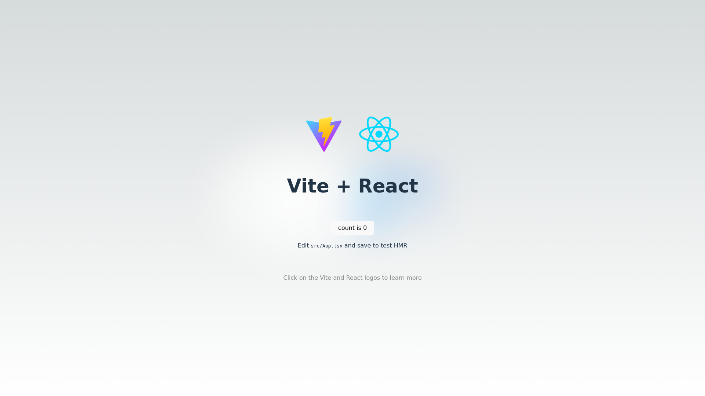

# readme-screenshot-action

READMEのスクリーンショットを自動更新します。

## Inputs

### `urls`
***Required***: スクリーンショットを撮る対象のURL。  
例:
```yaml
urls: |
  http://localhost:3000/
  http://localhost:3000/hello
```

### `server_command`
***Optional***: サーバーを起動するためのコマンド。  
例: `"npm start"`

### `server_working_dir`
***Optional***: サーバー起動コマンドを実行する作業ディレクトリ。  
例: `"path/to/working-directory"`

### `delay`
***Optional***: スクリーンショットを撮る前の遅延時間（ミリ秒）。  
デフォルト値: `0`

### `width`
***Optional***: ビューポートの横幅（CSSピクセル）。  
デフォルト値: `1920`

### `height`
***Optional***: ビューポートの高さ（CSSピクセル）。  
デフォルト値: `1080`

## Example usage

### 外部URL
```yaml
jobs:
  update_readme:
    runs-on: ubuntu-latest
    permissions:
      contents: write

    steps:
      - uses: actions/checkout@v4

      # Take screenshot and update README
      - uses: otaly/readme-screenshot-action@v1.0.1
        with:
          urls: |
            https://developer.chrome.com/
            https://developer.chrome.com/blog

      # Commit changes
      - uses: stefanzweifel/git-auto-commit-action@v5
        with:
          commit_message: Update screenshots
```

### Node.js
```yaml
jobs:
  update_readme:
    runs-on: ubuntu-latest
    permissions:
      contents: write

    steps:
      - uses: actions/checkout@v4

      # Set up Node.js
      - uses: actions/setup-node@v4
        with:
          node-version: 20

      # Install dependencies
      - run: npm install

      # Take screenshot and update README
      - uses: otaly/readme-screenshot-action@v1.0.1
        with:
          urls: |
            https://localhost:5173/
            https://localhost:5173/hello
          server_command: npm run dev

      # Commit changes
      - uses: stefanzweifel/git-auto-commit-action@v5
        with:
          commit_message: Update screenshots
```

## Example screenshots
<!-- :README-SCREENSHOT-BEGIN: -->


<!-- :README-SCREENSHOT-END: -->